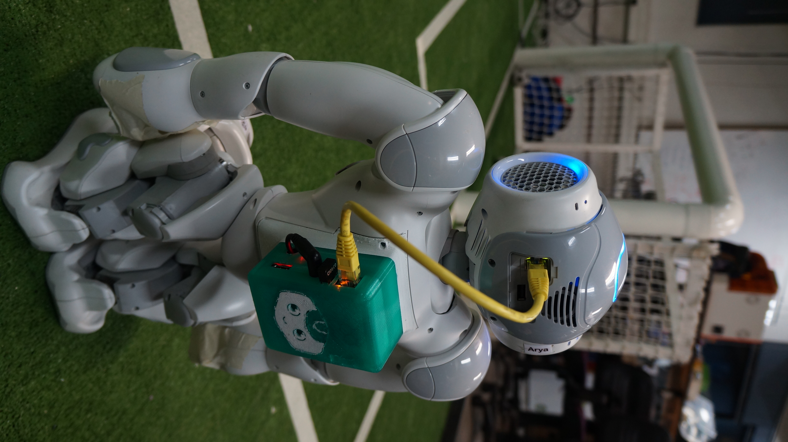

# The NAO Backpack package

This package accompanies the paper _"The NAO Backpack: An Open-hardware Add-on for Fast Software Development with the NAO Robot"_ accepted in the [RoboCup Symposium 2017](https://www.robocup2017.org/). Please feel free to contribute and collaborate via **issues** or **pull requests** :)

This package includes:

- A **CAD model** and instructions to print your own NAO backpack.
- An **URDF model** with the backpack. (**pending**)
- Some **B-Human framework's modules** to publish internal representations via UDP as well as **configuration files**.
- A **ROS node (bhuman2ros)** to publish the UDP messages from the NAO to ROS topics.

Please refer the **paper** [(PDF)](https://github.com/uchile-robotics/nao-backpack) for a general overview of the software.

**To cite this work:**

Matías Mattamala, Gonzalo Olave, Clayder González, Nicolás Hasbún, and Javier Ruiz-del-Solar. The NAO Backpack: An Open-hardware Add-on for Fast Software Development with the NAO Robot. RoboCup Symposium 2017, Nagoya, Japan, 2017. 

**Bibtex**

    @article{mattamalaRoboCup2017,
      title={ {The NAO Backpack: An Open-hardware Add-on for Fast Software Development with the NAO Robot}},
      author={Mattamala, Mat\'ias, Olave, Gonzalo, Gonz\'alez, Clayder, Hasb\'un, Nicol\'as, and Ruiz-del-Solar, Javier},
      year = {2017},
    }

## License
This work is licensed under **define**. Please refer the [LICENSE](LICENSE.md) file.

This package is built upon other libraries and frameworks. Here we list them, their respective authors and licenses.

* The **B-Human modules** provided here were developed to be compatible with the [B-Human Framework](https://github.com/bhuman/BHumanCodeRelease), as well as the _representations_ and _communication libraries_ used in the **bhuman2ros** node. The framework includes its own license; details can be found [here](https://github.com/bhuman/BHumanCodeRelease/blob/master/License.txt).
* The **URDF model we provide here** is based on [Armin Hornung's](http://wiki.ros.org/nao_robot), licensed under the [BSD](https://github.com/ros-naoqi/nao_robot/blob/master/LICENSE.txt).
* The `set_ros_master.sh` script is based on [Duckietown's](http://wwww.github.com/duckietown/Software.git).
* The `hotspot.sh` script is based on [Duckietown Chile's](http://www.github.com/Duckietown-Chile/Software.git).
